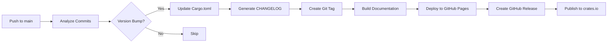

# Automatic Versioning & Release Process

This project uses **automated version bumping** based on [Conventional Commits](https://www.conventionalcommits.org/) and [Semantic Versioning](https://semver.org/).

## How It Works

### 1. Commit Messages Determine Version Bumps

The workflow analyzes your commit messages to automatically determine the appropriate version bump:

| Commit Type | Version Bump | Example |
|------------|--------------|---------|
| `feat:` | **Minor** (0.X.0) | `feat: add user authentication` |
| `fix:` | **Patch** (0.0.X) | `fix: resolve memory leak` |
| `perf:` | **Patch** (0.0.X) | `perf: optimize query performance` |
| `refactor:` | **Patch** (0.0.X) | `refactor: simplify error handling` |
| `docs:` | **Patch** (0.0.X) | `docs: update API documentation` |
| `style:` | **Patch** (0.0.X) | `style: fix code formatting` |
| `test:` | **Patch** (0.0.X) | `test: add integration tests` |
| `chore:` | **Patch** (0.0.X) | `chore: update dependencies` |
| `BREAKING CHANGE:` or `!` | **Major** (X.0.0) | `feat!: redesign authentication API` |

### 2. Automatic Release Workflow

When commits are pushed to the `main` branch:



## Commit Message Format

Follow this structure for your commits:

```
<type>(<scope>): <subject>

<body>

<footer>
```

### Examples

#### Feature (Minor Bump)
```
feat(iam): add user group management

Implement create, delete, and list operations for IAM user groups.
This allows better organization of users with similar permissions.

Closes #42
```

#### Bug Fix (Patch Bump)
```
fix(sts): correct session token expiration

Session tokens were expiring 1 hour too early due to timezone
conversion issue. Fixed by using UTC consistently.

Fixes #56
```

#### Breaking Change (Major Bump)
```
feat(api)!: redesign authentication flow

BREAKING CHANGE: The authenticate() method now returns Result<Session>
instead of Option<Session>. Update all callers to handle errors explicitly.

Migration guide:
- Before: if let Some(session) = authenticate(user) { ... }
- After: match authenticate(user) { Ok(session) => ..., Err(e) => ... }

Closes #78
```

## Manual Workflows

### Manual Documentation Deployment

Deploy documentation without a version bump:

```bash
# Via GitHub UI
Actions → Deploy Documentation (Manual) → Run workflow

# Or trigger via gh CLI
gh workflow run docs-manual.yml
```

### Manual Version Bump

Override automatic versioning:

```bash
# Via GitHub UI
Actions → Version Bump & Deploy Docs → Run workflow
  → Select version bump type (major/minor/patch)

# Or trigger via gh CLI
gh workflow run version-and-docs.yml -f version_bump=minor
```

## Version Bump Logic

The workflow uses this decision tree:

1. **Check for Breaking Changes**
   - Commit message contains `!` after type: `feat!:`
   - Footer contains `BREAKING CHANGE:`
   - → **MAJOR** bump (1.0.0 → 2.0.0)

2. **Check for Features**
   - Commit message starts with `feat:`
   - → **MINOR** bump (1.0.0 → 1.1.0)

3. **Check for Fixes/Improvements**
   - Commit message starts with `fix:`, `perf:`, `refactor:`, `docs:`, `style:`, `test:`, `chore:`
   - → **PATCH** bump (1.0.0 → 1.0.1)

4. **No Conventional Commits**
   - No recognizable commit pattern
   - → **No bump**, skip release

## Configuration

### Cargo.toml

The workflow automatically updates the version in `Cargo.toml`:

```toml
[package]
name = "rustyiam"
version = "0.1.0"  # ← Automatically updated
```

### CHANGELOG.md

The changelog is automatically generated using [git-cliff](https://git-cliff.org/) based on:
- Conventional commit messages
- Configuration in `cliff.toml`

### Secrets Required

For full automation, configure these GitHub secrets:

| Secret | Required For | Description |
|--------|-------------|-------------|
| `GITHUB_TOKEN` | Releases, Docs | Automatically provided by GitHub |
| `CARGO_REGISTRY_TOKEN` | crates.io | Generate at https://crates.io/settings/tokens |

### Skip Release

To push commits without triggering a release:

```bash
git commit -m "docs: update README [skip ci]"
```

Or use non-conventional commit format:

```bash
git commit -m "WIP: experimenting with new feature"
```

## Release Artifacts

Each release creates:

1. **Git Tag**: `vX.Y.Z` on the `main` branch
2. **GitHub Release**: With extracted changelog notes
3. **Documentation**: Deployed to GitHub Pages
4. **crates.io**: Published package (if token configured)

## Monitoring Releases

### Check Release Status

```bash
# List all releases
gh release list

# View specific release
gh release view v0.2.0

# Check workflow status
gh run list --workflow=version-and-docs.yml
```

### View Documentation

Documentation is automatically deployed to:
```
https://<username>.github.io/AMI.rs/rustyiam/
```

## Troubleshooting

### Version Bump Not Triggered

**Problem**: Pushed commits but no version bump occurred.

**Solutions**:
- Ensure commits follow conventional commit format
- Check workflow logs: `gh run list --workflow=version-and-docs.yml`
- Verify commits are on `main` branch
- Check if `[skip ci]` was in commit message

### Documentation Build Failed

**Problem**: Documentation deployment failed.

**Solutions**:
- Check for rustdoc warnings: `cargo doc --no-deps`
- Verify all `use` statements are correct
- Ensure `Cargo.toml` dependencies are valid
- Check workflow logs for specific errors

### crates.io Publish Failed

**Problem**: Package failed to publish to crates.io.

**Solutions**:
- Verify `CARGO_REGISTRY_TOKEN` is set correctly
- Check if version already exists: `cargo search rustyiam`
- Ensure all metadata in `Cargo.toml` is valid
- Verify no uncommitted changes: `git status`

### Release Notes Are Empty

**Problem**: GitHub release was created but has no description.

**Solutions**:
- Ensure `CHANGELOG.md` is being updated
- Check `cliff.toml` configuration
- Verify conventional commits are formatted correctly
- Manually edit release on GitHub if needed

## Best Practices

### 1. Write Descriptive Commit Messages

❌ **Bad**:
```bash
git commit -m "fix stuff"
git commit -m "update code"
```

✅ **Good**:
```bash
git commit -m "fix(iam): resolve user deletion race condition"
git commit -m "feat(sts): add support for SAML assertions"
```

### 2. Group Related Changes

Combine related changes in a single commit:

```bash
git add src/iam/users.rs tests/user_tests.rs
git commit -m "feat(iam): add user tagging support

- Implement tag_user() and untag_user() methods
- Add comprehensive test coverage
- Update documentation with examples"
```

### 3. Use Scope for Clarity

Scope helps identify which module/component changed:

```bash
feat(iam): ...      # IAM module
fix(sts): ...       # STS module
docs(readme): ...   # README file
test(integration): ...  # Integration tests
```

### 4. Document Breaking Changes

Always explain breaking changes in detail:

```bash
git commit -m "refactor(api)!: change error return type

BREAKING CHANGE: All API methods now return Result<T, Error>
instead of Option<T>.

Migration:
- Replace .unwrap() with proper error handling
- Update error messages to include context
- See examples/ for updated usage patterns"
```

## Examples

### Complete Feature Branch Workflow

```bash
# Create feature branch
git checkout -b feat/user-tags

# Make changes
# ... edit files ...

# Commit with conventional format
git add .
git commit -m "feat(iam): implement user tagging system

Add support for tagging IAM users with key-value pairs:
- Add tag_user() method
- Add list_user_tags() method
- Add remove_user_tag() method
- Comprehensive test coverage

Closes #42"

# Push and create PR
git push origin feat/user-tags
gh pr create --title "feat(iam): implement user tagging system" \
             --body "Adds user tagging support. Closes #42"

# After PR approval and merge to main:
# → Automatic MINOR version bump (0.1.0 → 0.2.0)
# → Documentation deployed
# → GitHub release created
# → Published to crates.io
```

## References

- [Conventional Commits](https://www.conventionalcommits.org/)
- [Semantic Versioning](https://semver.org/)
- [git-cliff Configuration](https://git-cliff.org/docs/configuration/)
- [GitHub Actions Workflows](https://docs.github.com/en/actions)

